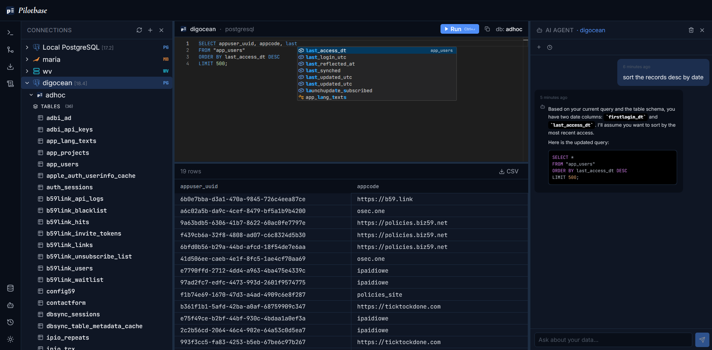

# Pilotbase

**The first open-source universal database GUI — a single db browser and client that unifies relational, NoSQL, and vector databases in one interface.**

Stop juggling pgAdmin, MongoDB Compass, RedisInsight, and separate vector DB dashboards. Pilotbase connects to your entire data stack — PostgreSQL, MySQL, SQLite, DuckDB, SQL Server, Oracle, Db2, CockroachDB, Snowflake, MongoDB, Redis, Cassandra, CouchDB, DynamoDB, Qdrant, ChromaDB, Weaviate, Pinecone, Milvus — and lets you query, browse, and manage everything from a single, modern web UI with an AI agent built in.

> **Beta 1.2** — Core query, schema browsing, and connection management are stable. AI-assisted natural-language querying, schema/data migration, on-demand backups, and a native desktop app (Windows, macOS, Linux) are live. See [RELEASE_NOTES.md](RELEASE_NOTES.md) for what's new.



---

## Why Pilotbase?

- **One tool for every database type** — SQL, document, key-value, and vector, with a consistent interface across all of them
- **A true universal database client** — the kind of cross-engine database IDE and SQL client that tools like DBeaver or TablePlus offer per-engine, but with NoSQL and vector databases included too
- **AI agent that understands your data** — ask questions in plain English, get query results, schema explanations, and insights powered by a local or hosted LLM
- **Zero lock-in** — open source (MIT), self-hosted, runs in Docker in minutes or as a native desktop app
- **Built for AI-era data stacks** — first-class support for vector databases and chunk-level browsing, built for teams that run RAG pipelines alongside traditional databases

---

## Features

### Universal Database Connectivity
- **Relational (SQL)** — PostgreSQL, MySQL, MariaDB, SQLite, DuckDB, Microsoft SQL Server, Oracle, Db2, CockroachDB, Snowflake
- **NoSQL** — MongoDB (find queries + aggregation pipelines), Redis (native command interface), Cassandra (CQL), CouchDB (Mango queries), DynamoDB (scan/get-item)
- **Vector** — Qdrant, ChromaDB, Weaviate, Pinecone, Milvus — browse embeddings, run similarity search, view and edit payloads

### Query & Browse
- Monaco-based editor with SQL syntax highlighting and `Ctrl+Enter` to run
- Tabbed main area — keep multiple queries, tables, and tools open side by side
- Resizable split pane — editor on top, results table below
- Query history
- Schema tree — browse databases, schemas, tables, views, collections, and keys
- Table/collection inspector — column types, primary keys, foreign keys, indexes
- NoSQL document viewer with rich JSON rendering
- Vector chunk browser with similarity search, pagination, and inline payload editing

### Manage
- Schema and data migration between connections — pick objects, review the plan, watch the run
- On-demand database backups
- Export as SQL
- Per-connection public REST API generation

### MCP Server (Desktop App)
- Built-in [MCP](https://modelcontextprotocol.io) server lets **Claude Desktop / Claude Cowork** (or any MCP client) explore your databases through Pilotbase. It can list connections, browse schemas, describe tables, run queries, export SQL, and diff schemas
- Uses the connections already saved in Pilotbase; credentials never leave the app
- Read-only by default; set `MCP_ALLOW_WRITES=true` to enable DDL, migrations, connection management and other write tools
- One-click setup: **Help → Copy Claude MCP config**; live status shown in the top-right **MCP** indicator
- Pilotbase's own AI agent is not exposed over MCP

### AI Agent (LangGraph + ReAct)
- Conversational assistant connected to your active database
- Understands your schema automatically — no manual context needed
- Ask: *"Show me the top 10 customers by revenue this month"* — it writes and runs the query
- Agent warns before any write or destructive operation and asks for confirmation
- Pluggable LLM — Ollama (local or cloud) or OpenRouter, configurable from the in-app **Settings** screen (`Ctrl/Cmd+,`), or any OpenAI-compatible API via env vars
- Chat sessions persist and the last session is restored on startup

### Security & Multi-User
- Encrypted credential storage (Fernet symmetric encryption) for passwords, API keys, bearer tokens, and LLM API keys
- Token-based invite links for adding users
- Pluggable `AuthBackend` interface — drop in JWT, OAuth2, LDAP, or SSO
- Per-connection read/write/admin permission grants
- Desktop backend binds to `127.0.0.1` only, guarded by a per-launch token

---

## Tech Stack

| Layer | Technology |
|---|---|
| Frontend | React 18, TypeScript, Vite, Tailwind CSS, Monaco Editor, Zustand |
| Backend | FastAPI (Python 3.13), SQLAlchemy 2, Alembic |
| AI | LangGraph ReAct agent, LangChain, OpenAI-compatible LLM |
| Real-time | WebSockets for live query streaming |
| Auth | Pluggable `AuthBackend` interface (anonymous mode included) |
| Packaging | Docker multi-stage build (Node 20 → Python 3.13), Docker Compose |
| Desktop | Electron shell, PyInstaller-bundled backend sidecar, SQLite, electron-builder |

---

## Quick Start (Docker — recommended)

**Requirements:** Docker 24+ and Docker Compose v2+.

```bash
git clone https://github.com/icedsg/pilotbase.git
cd pilotbase
cp api/.env.example api/.env
```

Edit `api/.env` and set at minimum:

```env
SECRET_KEY=<generate with: python -c "import secrets; print(secrets.token_hex(32))">
ENCRYPTION_KEY=<generate with: python -c "from cryptography.fernet import Fernet; print(Fernet.generate_key().decode())">
```

> **Important:** `ENCRYPTION_KEY` must be a valid Fernet key set **before** you create any database connections, and it must never change afterward. Every stored connection password is encrypted with this key — if you change it later, Pilotbase can no longer decrypt existing passwords, and you'll need to re-enter credentials for every affected connection. Generate it once and keep it stable (e.g. in a secrets manager or a `.env` file that persists across deploys).

Then start:

```bash
docker compose up --build
```

Pilotbase will be live at **[http://localhost:8000](http://localhost:8000)**.

The first run builds the React frontend and installs all dependencies inside the image — expect 2–3 minutes. Subsequent starts are instant.

That's all that's required to connect to your databases and start querying — the AI agent, backup location, migration, and per-connection public API are all optional and can be set up later, whenever you need them. For a full section-by-section walkthrough of every `api/.env` variable, with sample values and what's optional vs. required, see the **[Installation Guide](docs/installation.md)**.

---

## Local Development Setup

Prefer running the backend and frontend separately with hot reload instead of Docker? See the full **[Local Development Setup guide](docs/local-development.md)** (Python venv, Alembic migrations, Vite dev server).

---

## Desktop App

Prefer a native app over Docker? Pilotbase Desktop wraps the same FastAPI backend and React UI in Electron — no Docker or Postgres required, with data stored locally in SQLite. Bring your own LLM API key and database connections through the same in-app **Settings** screen (`Ctrl/Cmd+,`) used by the web version.

**[⬇ Download the latest release](https://github.com/icedsg/pilotbase/releases/latest)** — installers are built and attached automatically for every tagged release:

| Platform | File |
|---|---|
| Windows (x64) | `Pilotbase-Setup-<version>-win-x64.exe` |
| macOS (Apple Silicon) | `Pilotbase-<version>-mac-arm64.dmg` |
| macOS (Intel) | `Pilotbase-<version>-mac-x64.dmg` |
| Linux (x64) | `Pilotbase-<version>-linux-x64.AppImage` |

Prefer to build it yourself instead? See the **[Desktop build guide](desktop/README.md)** for setup and packaging instructions, and the **[Desktop technical spec](docs/desktop-plan.md)** for architecture details. Tagged releases (`v*.*.*`) build installers for every platform via [GitHub Actions](.github/workflows/desktop.yml).

**Use Pilotbase from Claude (MCP):** the desktop app includes an MCP server, so Claude Desktop and Claude Cowork can explore your databases through Pilotbase. With the app open, choose **Help → Copy Claude MCP config**, paste the snippet into Claude Desktop's `claude_desktop_config.json`, and restart Claude Desktop. The **MCP** indicator in the top-right status panel shows whether it's active and whether it's read-only or read-write. See **[MCP setup](docs/mcp.md)** for the full tool list.

---

## Setting Up Ollama (for the AI Agent)

Pilotbase's AI agent talks to any OpenAI-compatible LLM endpoint, and defaults to Ollama. The quickest way to configure it is the **Settings** screen (gear icon in the activity bar, or `Ctrl/Cmd+,`): pick Ollama or OpenRouter, set the model and API key, and hit **Test**. Values saved there are stored encrypted in Pilotbase's database and take precedence over `api/.env`.

To run models locally instead of using Ollama's hosted cloud:

1. Install Ollama from [ollama.com/download](https://ollama.com/download)
2. Pull a model: `ollama pull gemma4:31b-cloud` (or any model you prefer)
3. Confirm it's running: `ollama list`
4. In **Settings** choose Ollama and your model — or in `api/.env`, set:
   ```env
   OLLAMA_BASE_URL=http://localhost:11434/v1
   OLLAMA_MODEL=<your model name>
   OLLAMA_API_KEY=ollama
   ```
5. Restart the backend (or `docker compose up --build` again if running in Docker)

No local GPU or Ollama install? Leave `OLLAMA_BASE_URL` at its default and the agent will use Ollama's hosted cloud models instead — just set a valid `OLLAMA_API_KEY`.

---

## Configuration Reference

- **[Installation Guide](docs/installation.md)** — step-by-step setup with every `api/.env` section explained and sample values, plus what's required vs. optional (AI agent, backups, migration, public API)
- **[Configuration Reference](docs/configuration.md)** — flat table of every variable, default, and description

---

## Supported Databases

Full feature matrix (create/drop DB, migration, backups, AI agent query support, per-engine notes) across all 19 supported engines: **[Supported Databases](docs/supported-databases.md)**.

---

## Database Comparisons

Honest, detailed write-ups on how Pilotbase compares to the admin tool you're probably already using for each engine — including where the other tool still wins:

- [PostgreSQL](https://github.com/icedsg/pilotbase/blob/master/docs/comparisons/postgresql.md) — best Postgres admin UIs compared (pgAdmin, DBeaver, TablePlus, Postico, Beekeeper Studio)
- [MySQL / MariaDB](https://github.com/icedsg/pilotbase/blob/master/docs/comparisons/mysql.md) — best MySQL admin UIs compared (MySQL Workbench, phpMyAdmin, DBeaver, HeidiSQL, TablePlus)
- [SQLite](https://github.com/icedsg/pilotbase/blob/master/docs/comparisons/sqlite.md) — vs DB Browser for SQLite
- [DuckDB](https://github.com/icedsg/pilotbase/blob/master/docs/comparisons/duckdb.md) — vs the DuckDB CLI/notebook workflow
- [SQL Server](https://github.com/icedsg/pilotbase/blob/master/docs/comparisons/sql-server.md) — vs SQL Server Management Studio (SSMS)
- [Oracle](https://github.com/icedsg/pilotbase/blob/master/docs/comparisons/oracle.md) — vs Oracle SQL Developer
- [Db2](https://github.com/icedsg/pilotbase/blob/master/docs/comparisons/db2.md) — vs IBM Db2 Data Studio / web console
- [CockroachDB](https://github.com/icedsg/pilotbase/blob/master/docs/comparisons/cockroachdb.md) — vs CockroachDB's built-in DB Console
- [Snowflake](https://github.com/icedsg/pilotbase/blob/master/docs/comparisons/snowflake.md) — vs Snowsight
- [MongoDB](https://github.com/icedsg/pilotbase/blob/master/docs/comparisons/mongodb.md) — vs MongoDB Compass
- [Redis](https://github.com/icedsg/pilotbase/blob/master/docs/comparisons/redis.md) — vs RedisInsight
- [Cassandra](https://github.com/icedsg/pilotbase/blob/master/docs/comparisons/cassandra.md) — the best admin UI for Cassandra
- [CouchDB](https://github.com/icedsg/pilotbase/blob/master/docs/comparisons/couchdb.md) — vs Fauxton, CouchDB's built-in admin UI
- [DynamoDB](https://github.com/icedsg/pilotbase/blob/master/docs/comparisons/dynamodb.md) — the best admin UI for DynamoDB
- [Qdrant](https://github.com/icedsg/pilotbase/blob/master/docs/comparisons/qdrant.md) — vs Qdrant's built-in Web UI
- [ChromaDB](https://github.com/icedsg/pilotbase/blob/master/docs/comparisons/chromadb.md) — the best admin UI for ChromaDB
- [Weaviate](https://github.com/icedsg/pilotbase/blob/master/docs/comparisons/weaviate.md) — vs Weaviate Cloud Console
- [Pinecone](https://github.com/icedsg/pilotbase/blob/master/docs/comparisons/pinecone.md) — vs Pinecone Console
- [Milvus](https://github.com/icedsg/pilotbase/blob/master/docs/comparisons/milvus.md) — vs Attu

---

## Using the AI Agent

1. Select any connection in the left sidebar
2. Open the **AI** panel from the right sidebar
3. Ask anything in plain English

Example prompts:
- *"List all tables and their row counts"*
- *"Find all orders placed in the last 7 days with amount over $500"*
- *"Are there any duplicate email addresses in the users table?"*
- *"Describe the schema of the products table"*
- *"What indexes exist on the orders table?"*

The agent automatically inspects your schema and picks the right query strategy. For write operations (INSERT, UPDATE, DELETE, DROP), it will always explain what it plans to do and ask for confirmation first.

---

## Authentication

By default Pilotbase uses anonymous authentication — a `user_anon_id` is stored in a browser cookie, no login required. This is ideal for self-hosted single-user or trusted-network deployments.

To add custom authentication, implement the `AuthBackend` abstract class in `api/app/auth/base.py` and set the `AUTH_BACKEND` env var to the dotted Python path of your implementation. The interface supports any mechanism: JWT, session cookies, OAuth2, LDAP, or API keys.

---

## Project Structure

```
pilotbase/
├── api/                        # FastAPI backend (Python 3.13)
│   ├── main.py                 # Uvicorn entry point (also the desktop sidecar entry)
│   ├── requirements.txt
│   ├── defaultConnections.py   # Optional connections seeded on startup
│   ├── pilotbase-api.spec      # PyInstaller spec for the desktop sidecar binary
│   ├── alembic/                # Migrations for Pilotbase's own DB
│   └── app/
│       ├── config.py           # Pydantic settings
│       ├── database.py         # SQLAlchemy engine for Pilotbase's own DB
│       ├── models/             # ORM models (User, DbConnection, AppSetting, etc.)
│       ├── routers/            # REST API routes (query, migration, backup, export, papi, settings, ...)
│       ├── services/           # DB adapters, backup, migration, export, LLM settings
│       ├── agents/             # LangGraph AI agent + tools
│       ├── auth/               # Pluggable auth backend interface
│       ├── middleware/         # Desktop local-token guard
│       └── websocket/          # Real-time WebSocket manager
├── ui/                         # React + Vite frontend (TypeScript)
│   └── src/
│       ├── api/                # REST client
│       ├── components/
│       │   ├── layout/         # ActivityBar, TopBar, LeftPanel, RightPanel, MainArea
│       │   ├── db/             # ConnectionTree, QueryEditor, ResultsTable, VectorChunksView
│       │   ├── migration/      # Migration flow (object picker, plan review, run view)
│       │   ├── backup/         # Backup modal
│       │   ├── papi/           # Public API configuration
│       │   ├── settings/       # Settings + model picker
│       │   └── common/         # Logo and shared components
│       ├── knowledge/          # Per-engine data-type catalogs loader
│       ├── lib/                # Desktop bridge and helpers
│       ├── hooks/              # useWebSocket, useUserSession
│       ├── store/              # Zustand global state
│       └── types/              # Shared TypeScript types
├── desktop/                    # Electron shell (main process, preload, packaging config)
├── knowledge/                  # Per-engine data-type catalogs (JSON)
├── docs/                       # Installation, configuration, supported DBs, comparisons, desktop spec
├── .github/                    # CI workflows (desktop builds, CLA) and CODEOWNERS
├── Dockerfile                  # Multi-stage build (Node 20 → Python 3.13 slim)
├── docker-compose.yml          # Self-hosted stack
├── RELEASE_NOTES.md
├── CONTRIBUTING.md
├── CLA.md                      # Contributor License Agreement
└── LICENSE                     # MIT License
```

---

## Roadmap

- [x] Multi-type connection management with encrypted credential storage
- [x] Monaco SQL editor with keyboard shortcuts and results table
- [x] Schema / collection tree browser
- [x] NoSQL document viewer (MongoDB)
- [x] Vector chunk browser with ANN search (Qdrant, ChromaDB, Weaviate, Pinecone, Milvus)
- [x] LangGraph AI agent with natural language querying
- [x] Per-connection user access control
- [x] Schema migration: diff and apply across two connections
- [x] On-demand database backups and Export as SQL
- [x] Query history
- [x] Native desktop app (Electron) with in-app AI provider settings
- [-] Token-based invite links *(backend done — UI in progress)*
- [ ] Scheduled backups
- [ ] Saved queries
- [ ] ER diagram view
- [ ] Full user/role management UI
- [ ] Custom auth backend examples and documentation

---

## Contributing

Contributions are welcome.

### Good first contributions

- **Testing supported databases** — try Pilotbase against the databases it claims to support and report what breaks.
- **Test scripts** — add automated tests for adapters, auth backends, or UI components.
- **UI improvements** — React + TypeScript, Tailwind, Zustand for state. Components are small and isolated under `ui/src/components/`.
- **Security** — review auth flows, connection handling, and query execution for issues.
- **Bug fixes and docs** — always welcome, no issue required.

### How to submit

1. Fork the repo and create a feature branch
2. Open an issue first for large features or breaking changes
3. Submit a pull request against `master`
4. Sign the CLA when the bot prompts you (one-time; see [CONTRIBUTING.md](CONTRIBUTING.md))

---

## Guides & Screenshots

Walkthroughs with real screenshots live on **[pilotbase.pro](https://pilotbase.pro)**:

- [Ask your database a question — the AI agent writes the query](https://pilotbase.pro/articles/ai-agent-writes-the-query)
- [Migrate, back up, and expose your data safely](https://pilotbase.pro/articles/migrate-backup-expose-safely) — migration, backups, Export as SQL, generated API
- [One tool now covers 19 database engines](https://pilotbase.pro/articles/one-tool-nineteen-database-engines)
- [Vector databases are first-class citizens](https://pilotbase.pro/articles/vector-databases-first-class)
- [Pilotbase is now a native desktop app](https://pilotbase.pro/articles/pilotbase-native-desktop-app)
- [Open source under MIT, and yours to self-host](https://pilotbase.pro/articles/source-available-self-host)
- [pgAdmin 4 vs Pilotbase: the same Postgres jobs, side by side](https://pilotbase.pro/articles/pgadmin-vs-pilotbase)

### AI agent


*"Show me the top 10 orders by value": the agent writes the query, puts it in the editor and runs it.*


*Writes become a plan you approve. Nothing touches the table until you click **Approve & commit**.*

### Migration


*PostgreSQL → MySQL: every table, where it exists, rows on each side and source size.*


*The plan review: exclude any change, then **Run Migration**.*

### Export as SQL


*Pick tables and options on the left, preview the script on the right.*

---

## License

[MIT License](LICENSE) — Copyright (c) 2026 Pilotbase (pilotbase.pro). Free to use, modify, self-host, and redistribute, including commercially, as long as the copyright and license notice are kept.

The hosted [Pilotbase.pro](https://pilotbase.pro) product includes additional features beyond this open source edition. Those are offered under separate terms and are not part of this repository. Contributions are governed by the [CLA](CLA.md).

---

## [Pilotbase.pro](https://pilotbase.pro)

Don't want to run the stack yourself? **[Pilotbase.pro](https://pilotbase.pro)** is a subscription service that hosts Pilotbase for you — with a private, dedicated container provisioned near your databases, so you connect and query with zero infrastructure to manage. Same Pilotbase, fully managed.
